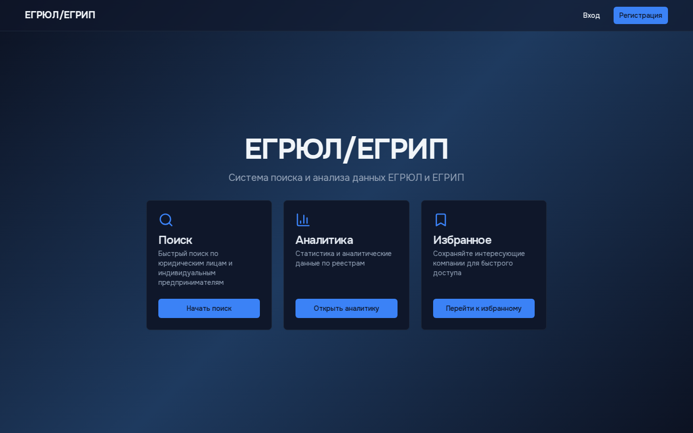
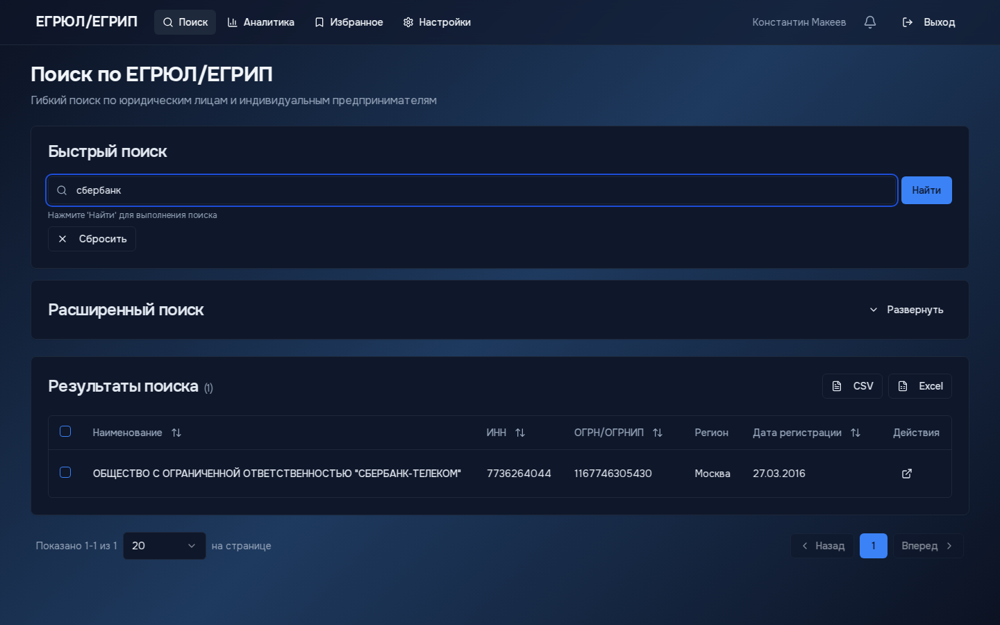
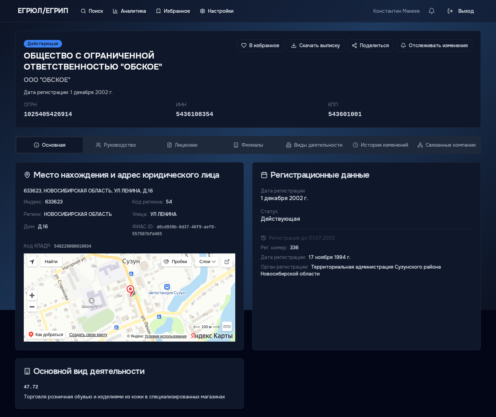
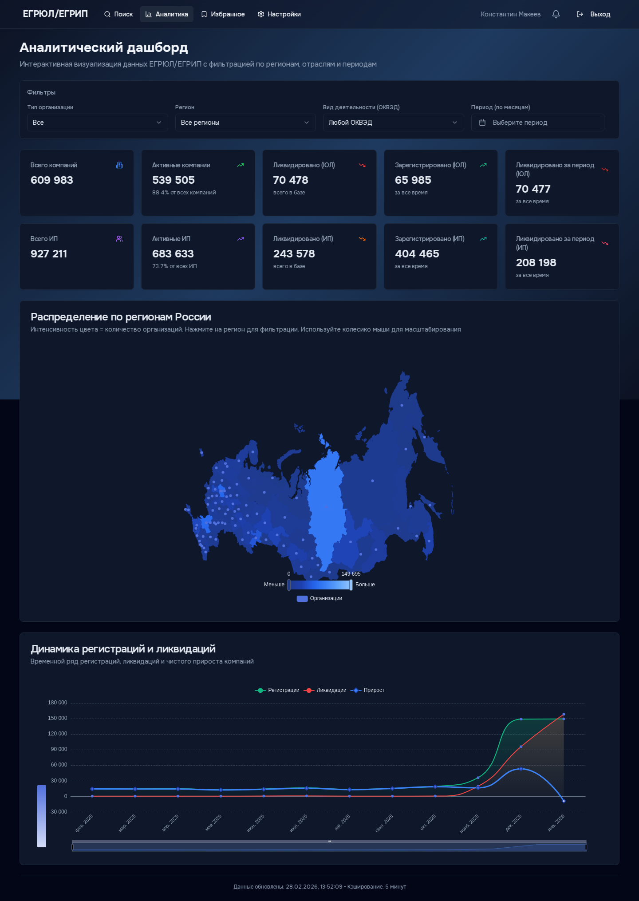
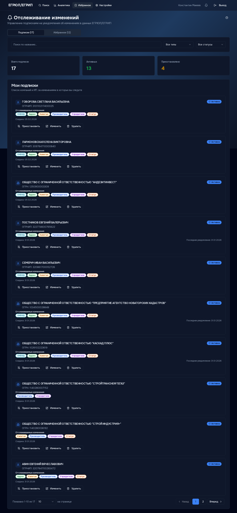
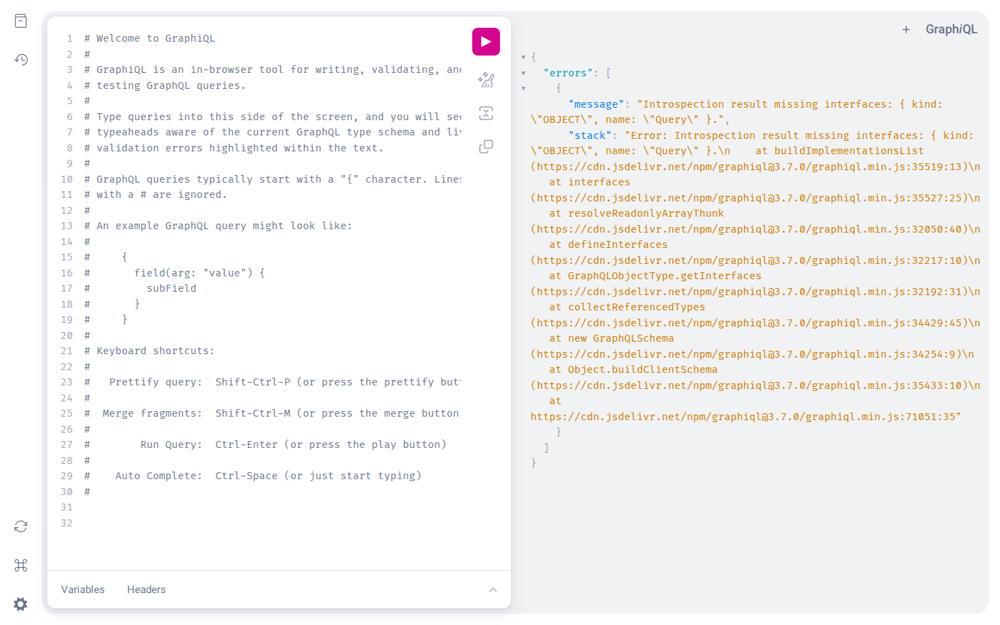

# ЕГРЮЛ/ЕГРИП Система

> Высокопроизводительная система обработки и поиска данных из реестров ЕГРЮЛ (Единый государственный реестр юридических лиц) и ЕГРИП (Единый государственный реестр индивидуальных предпринимателей).

## ✨ Возможности

- 🚀 **Быстрый парсинг** - Rust парсер обрабатывает XML → Parquet
- 📊 **Аналитика** - ClickHouse для хранения и анализа миллионов записей
- 🔍 **Полнотекстовый поиск** - Elasticsearch для быстрого поиска
- 🎨 **Современный UI** - Next.js 15 + React 19 + TanStack Query
- 🔔 **Отслеживание изменений** - Подписки на изменения компаний/ИП с email уведомлениями (NEW)
- 🔄 **Event Streaming** - Kafka для обработки событий изменений
- 💾 **S3 Storage** - MinIO для хранения файлов
- 🛠️ **UI Tools** - Adminer, RedisInsight, MinIO Console, MailHog
- 📈 **Monitoring** - Grafana + ClickHouse datasource
- 🐳 **Full Docker** - Полная инфраструктура в Docker Compose
- 🎯 **Profiles** - Гибкая конфигурация для dev/prod окружений

## 🏗️ Архитектура

```
                    ┌──────────────────────────────┐
                    │   Frontend (Next.js/React)   │
                    │   - Watchlist (subscriptions)│
                    └──────────────┬───────────────┘
                                   │
                    ┌──────────────▼───────────────┐
                    │   API Gateway (Go/GraphQL)   │
                    │   - Subscription management  │
                    └──────────────┬───────────────┘
                                   │
        ┌──────────────┬───────────┼────────────┬──────────────┐
        ▼              ▼           ▼            ▼              ▼
┌────────────┐  ┌──────────┐ ┌──────────┐ ┌─────────┐  ┌──────────┐
│ClickHouse  │  │PostgreSQL│ │  Redis   │ │  Kafka  │  │  MinIO   │
│(Аналитика) │  │(Metadata │ │  (Кэш)   │ │(Events) │  │(Файлы)   │
│ +Changes   │  │+Subscrip)│ │          │ │         │  │          │
└──────┬─────┘  └────┬─────┘ └──────────┘ └────┬────┘  └──────────┘
       │             │                          │
       │             │         ┌────────────────▼────────────────┐
       │             │         │  Change Detection Service (Go)  │
       │             │         │  - Detects changes in data      │
       │             │         │  - Produces Kafka events        │
       │             │         └──────────────┬──────────────────┘
       │             │                        │
       │             │         ┌──────────────▼──────────────────┐
       │             └────────>│  Notification Service (Go)      │
       │                       │  - Consumes change events       │
       │                       │  - Sends email notifications    │
       │                       └─────────────────────────────────┘
       │
       │             ┌──────────────┐
       └────────────>│Search Service│
                     │     (Go)     │
                     └──────┬───────┘
                            │
                     ┌──────▼──────┐
                     │Elasticsearch│
                     │   (Поиск)   │
                     └─────────────┘

┌─────────────────────────────────────────────────────────────────┐
│  XML Parser (Rust) → Parquet → ClickHouse → Change Detection   │
└─────────────────────────────────────────────────────────────────┘

UI Tools: Adminer (PostgreSQL) | RedisInsight (Redis) | MinIO Console | MailHog (SMTP)
Monitoring: Grafana + ClickHouse datasource
```

## 🖼️ Интерфейс системы

| Главная страница | Поиск по реестрам |
|:---:|:---:|
|  |  |

| Карточка компании | Аналитический дашборд |
|:---:|:---:|
|  |  |

| Отслеживание изменений | GraphQL Playground |
|:---:|:---:|
|  |  |

## 📁 Структура проекта

```
egrul-system/
├── parser/                     # Rust XML парсер
│   ├── src/
│   │   ├── main.rs
│   │   ├── models.rs          # Модели данных
│   │   └── parser.rs          # Логика парсинга
│   └── Cargo.toml
│
├── services/
│   ├── api-gateway/           # Go API Gateway
│   │   ├── main.go
│   │   ├── go.mod
│   │   └── Dockerfile
│   │
│   ├── search-service/        # Go Search Service
│   │   ├── main.go
│   │   ├── go.mod
│   │   └── Dockerfile
│   │
│   ├── change-detection-service/  # Go Change Detection (NEW)
│   │   ├── cmd/server/
│   │   ├── internal/
│   │   │   ├── detector/      # Change comparison logic
│   │   │   ├── kafka/         # Kafka producer
│   │   │   └── repository/    # ClickHouse access
│   │   ├── go.mod
│   │   └── Dockerfile
│   │
│   ├── notification-service/  # Go Notification Service (NEW)
│   │   ├── cmd/server/
│   │   ├── internal/
│   │   │   ├── consumer/      # Kafka consumer
│   │   │   ├── channels/      # Email sender
│   │   │   ├── templates/     # Email templates
│   │   │   └── repository/    # PostgreSQL access
│   │   ├── go.mod
│   │   └── Dockerfile
│   │
│   └── shared/                # Общие Go пакеты
│       ├── models/
│       └── config/
│
├── frontend/                   # Next.js Frontend
│   ├── src/
│   │   ├── app/
│   │   ├── components/
│   │   └── lib/
│   ├── package.json
│   └── Dockerfile
│
├── infrastructure/
│   ├── docker/
│   │   ├── clickhouse/        # Custom ClickHouse образ
│   │   ├── parser/
│   │   │   └── Dockerfile     # Оптимизированный parser
│   │   └── init-db.sql
│   ├── migrations/
│   │   └── clickhouse/        # ClickHouse миграции
│   └── scripts/
│       ├── setup.sh
│       ├── parse-data.sh
│       ├── import-data.sh
│       ├── init-db.sh         # PostgreSQL метаданные
│       └── seed-data.sh       # Загрузка тестовых данных
│
├── docs/                       # Документация
│
├── docker-compose.yml          # Базовая конфигурация
├── docker-compose.override.yml # Dev mode (hot reload)
├── docker-compose.prod.yml     # Production настройки
│
├── .env.example                # Шаблон переменных (100+)
├── .env.development            # Dev переменные
├── .env.production             # Prod переменные
│
├── Makefile                    # 60+ команд
├── package.json
├── pnpm-workspace.yaml
└── Cargo.toml
```

## 🚀 Быстрый старт

### Требования

- Docker & Docker Compose
- Node.js >= 20.x
- pnpm >= 9.x
- Rust >= 1.75
- Go >= 1.23

### Установка

```bash
# Клонирование репозитория
git clone <repository-url>
cd egrul-system

# Настройка переменных окружения
cp .env.example .env
# Отредактируйте .env при необходимости

# Настройка проекта
make setup

# Запуск в режиме разработки
make dev
```

### Запуск Docker окружения

> **Важно:** Система использует ClickHouse кластер (6 нод + 3 Keeper). Single-node режим отключен.

```bash
# Запуск всей инфраструктуры (кластер + все сервисы)
make up
# Запускает:
# - ClickHouse кластер (6 nodes + 3 Keeper)
# - PostgreSQL, Elasticsearch, Redis, Kafka, MinIO
# - API Gateway, Search Service, Frontend
# - Change Detection & Notification Services
# - UI Tools (Adminer, RedisInsight, MailHog)

# Альтернативные команды (алиасы)
make docker-up          # То же что make up
make docker-up-full     # То же что make up

# Просмотр логов
make docker-logs

# Остановка всей системы
make down
# или
make docker-down
```

**Доступные сервисы после запуска:**
- Frontend: http://localhost:3000
- GraphQL Playground: http://localhost:8080/playground
- MailHog UI: http://localhost:8025
- MinIO Console: http://localhost:9011
- Adminer (PostgreSQL): http://localhost:8090
- RedisInsight: http://localhost:8091

### Архитектура развертывания

**ClickHouse Cluster** (обязательно):
- 6 нод ClickHouse: 3 шарда × 2 реплики
- 3 ноды ClickHouse Keeper (Raft-based координация)
- Шардирование по хэшу ОГРН/ОГРНИП (обеспечивает корректную дедупликацию ReplacingMergeTree)
- Асинхронная репликация (RF=2)
- Distributed таблицы поверх локальных

**Запуск через `make up`** автоматически стартует весь стек:
1. ClickHouse кластер (docker-compose.cluster.yml)
2. Базовые сервисы (PostgreSQL, Redis, Kafka, Elasticsearch)
3. Прикладные сервисы (API Gateway, Frontend, Change Detection, Notification)
4. UI Tools (Adminer, RedisInsight, MailHog, MinIO Console)

## 📋 Доступные команды

```bash
make help              # Показать все команды (60+)

# Общие
make setup             # Начальная настройка
make up                # Запуск всей системы (кластер + сервисы)
make down              # Остановка всей системы
make dev               # Режим разработки
make build             # Сборка всех компонентов
make test              # Запуск тестов
make clean             # Очистка артефактов

# Docker
make docker-up         # Алиас для make up
make docker-down       # Алиас для make down
make docker-logs       # Просмотр логов
make docker-build      # Сборка Docker образов
make docker-clean      # Очистка Docker

# Parser (Rust)
make parser-build      # Сборка парсера
make parser-run        # Запуск парсера
make parser-test       # Тесты парсера

# Services (Go)
make services-build    # Сборка сервисов
make services-test     # Тесты сервисов

# Frontend (Next.js)
make frontend-dev      # Режим разработки
make frontend-build    # Сборка
make screenshots       # Снять скриншоты основных страниц (требует: make up)

# ClickHouse Cluster (single-node отключен)
make cluster-up        # Запуск кластера
make cluster-down      # Остановка кластера
make cluster-reset     # Пересоздать БД на всех нодах
make cluster-truncate  # Очистить все таблицы
make cluster-import    # Импорт данных в кластер
make cluster-verify    # Проверка состояния кластера
make cluster-test      # Тестирование кластера
make cluster-ps        # Статус нод
make cluster-logs      # Просмотр логов

# Алиасы для обратной совместимости
make ch-shell          # Консоль (подключение к node-01)
make ch-stats          # Статистика кластера
make ch-truncate       # Алиас для cluster-truncate
make ch-reset          # Алиас для cluster-reset

# Data Management
make import            # Импорт данных из Parquet
make import-basic      # Базовый импорт
make seed-data         # Загрузить тестовые данные
make init-db           # Инициализировать PostgreSQL метаданные

# Kafka
make kafka-topics      # Список топиков
make kafka-create-topic TOPIC=name  # Создать топик
make kafka-console TOPIC=name       # Console consumer

# MinIO
make minio-console     # Открыть MinIO Console
make minio-upload      # Загрузить файлы

# UI Tools
make adminer           # Открыть Adminer (PostgreSQL)
make redisinsight      # Открыть RedisInsight (Redis)

# Pipeline
make pipeline INPUT=./data  # Полный пайплайн: парсинг → импорт
```

## 🔧 Конфигурация

### Environment Variables

Проект использует систему .env файлов для управления конфигурацией:

```bash
.env.example         # Полный шаблон (100+ переменных)
.env.development     # Development настройки
.env.production      # Production настройки
.env                 # Локальные переменные (не коммитятся)
```

**Быстрый старт:**

```bash
# Для разработки
cp .env.development .env

# Для production
cp .env.production .env
# Измените пароли и секретные ключи!
```

### Основные переменные

#### PostgreSQL
| Переменная | Описание | По умолчанию |
|------------|----------|--------------|
| `POSTGRES_HOST` | Хост PostgreSQL | `postgres` |
| `POSTGRES_PORT` | Порт PostgreSQL | `5432` |
| `POSTGRES_DB` | Имя базы данных | `egrul` |
| `POSTGRES_USER` | Пользователь | `postgres` |
| `POSTGRES_PASSWORD` | Пароль | `postgres` |

#### ClickHouse
| Переменная | Описание | По умолчанию |
|------------|----------|--------------|
| `CLICKHOUSE_HOST` | Хост ClickHouse (node-01 кластера) | `clickhouse-01` |
| `CLICKHOUSE_HTTP_PORT` | HTTP порт | `8123` |
| `CLICKHOUSE_NATIVE_PORT` | Native TCP порт | `9000` |
| `CLICKHOUSE_USER` | Пользователь | `egrul_app` |
| `CLICKHOUSE_PASSWORD` | Пароль | `test` |
| `CLICKHOUSE_MEMORY_LIMIT` | Лимит памяти | `16G` |

#### Kafka & Zookeeper (profile: full)
| Переменная | Описание | По умолчанию |
|------------|----------|--------------|
| `KAFKA_BROKER` | Внутренний адрес | `kafka:9092` |
| `KAFKA_EXTERNAL_BROKER` | Внешний адрес | `localhost:29092` |
| `KAFKA_HEAP_OPTS` | Java heap | `-Xms512m -Xmx512m` |
| `ZOOKEEPER_CLIENT_PORT` | Порт Zookeeper | `2181` |

#### MinIO (profile: full)
| Переменная | Описание | По умолчанию |
|------------|----------|--------------|
| `MINIO_ROOT_USER` | Пользователь | `minioadmin` |
| `MINIO_ROOT_PASSWORD` | Пароль | `minioadmin` |
| `MINIO_API_PORT` | API порт | `9010` |
| `MINIO_CONSOLE_PORT` | Console порт | `9011` |

#### API & Frontend
| Переменная | Описание | По умолчанию |
|------------|----------|--------------|
| `API_GATEWAY_PORT` | Порт API Gateway | `8080` |
| `FRONTEND_PORT` | Порт Frontend | `3000` |
| `LOG_LEVEL` | Уровень логов | `info` |
| `GRAPHQL_PLAYGROUND_ENABLED` | GraphQL Playground | `true` |

#### Subscription System (NEW - profile: full)
| Переменная | Описание | По умолчанию |
|------------|----------|--------------|
| `CHANGE_DETECTION_SERVICE_PORT` | Порт Change Detection | `8082` |
| `NOTIFICATION_SERVICE_PORT` | Порт Notification | `8083` |
| `SMTP_HOST` | SMTP сервер | `mailhog` (dev) |
| `SMTP_PORT` | SMTP порт | `1025` (dev) |
| `SMTP_USERNAME` | SMTP пользователь | - |
| `SMTP_PASSWORD` | SMTP пароль | - |
| `SMTP_FROM` | Email отправителя | `noreply@egrul.ru` |
| `SMTP_TLS` | Использовать TLS | `false` (dev) |
| `POSTGRES_SUBSCRIPTION_SCHEMA` | PostgreSQL схема | `subscriptions` |

См. [docs/SUBSCRIPTIONS.md](docs/SUBSCRIPTIONS.md) для подробной документации.

### Порты сервисов

| Сервис | Порт | URL |
|--------|------|-----|
| Frontend | 3000 | http://localhost:3000 |
| API Gateway | 8080 | http://localhost:8080 |
| GraphQL Playground | 8080 | http://localhost:8080/playground |
| Search Service | 8081 | http://localhost:8081 |
| PostgreSQL | 5432 | - |
| ClickHouse HTTP | 8123 | http://localhost:8123 |
| ClickHouse Native | 9000 | - |
| Elasticsearch | 9200 | http://localhost:9200 |
| Redis | 6379 | - |
| Kafka | 29092 | localhost:29092 |
| MinIO API | 9010 | http://localhost:9010 |
| MinIO Console | 9011 | http://localhost:9011 |
| Adminer | 8090 | http://localhost:8090 |
| RedisInsight | 8091 | http://localhost:8091 |
| Grafana | 3001 | http://localhost:3001 |

## 🎨 UI Инструменты

Система включает веб-интерфейсы для управления инфраструктурой:

### Adminer (PostgreSQL UI)
```bash
make adminer
# Или откройте: http://localhost:8090
```
- Сервер: `postgres`
- Пользователь: `postgres`
- Пароль: из `.env` (`POSTGRES_PASSWORD`)
- БД: `egrul`

### RedisInsight (Redis UI)
```bash
make redisinsight
# Или откройте: http://localhost:8091
```
Автоматически подключается к Redis на порту 6379.

### MinIO Console (S3 Storage UI)
```bash
make minio-console
# Или откройте: http://localhost:9011
```
- Пользователь: `minioadmin`
- Пароль: из `.env` (`MINIO_ROOT_PASSWORD`)

Buckets:
- `xml-files` - исходные XML файлы
- `parquet-files` - результаты парсинга
- `backups` - резервные копии

### Grafana (Monitoring)
```bash
make monitoring-up
# Откройте: http://localhost:3001
```
- Пользователь: `admin`
- Пароль: из `.env` (`GF_SECURITY_ADMIN_PASSWORD`)
- ClickHouse datasource установлен автоматически

## 📊 API Endpoints

### Юридические лица

```
GET  /api/v1/legal-entities          # Список юр. лиц
GET  /api/v1/legal-entities/:ogrn    # Юр. лицо по ОГРН
GET  /api/v1/legal-entities/search   # Поиск юр. лиц
```

### Индивидуальные предприниматели

```
GET  /api/v1/entrepreneurs           # Список ИП
GET  /api/v1/entrepreneurs/:ogrnip   # ИП по ОГРНИП
GET  /api/v1/entrepreneurs/search    # Поиск ИП
```

### Глобальный поиск

```
GET  /api/v1/search?q=<query>        # Поиск по всем реестрам
```

## 🔍 Парсинг и Импорт данных

### Быстрый старт с тестовыми данными

```bash
# Загрузить тестовые данные из test/ директорий
make seed-data
# Автоматически парсит XML и импортирует в ClickHouse
```

### Полный пайплайн

```bash
# Парсинг + Импорт с дополнительными ОКВЭД
make pipeline INPUT=./data

# Базовый импорт без ОКВЭД
make pipeline-basic INPUT=./data
```

### Пошаговый процесс

```bash
# 1. Парсинг XML в Parquet
make parser-run INPUT=./data/input OUTPUT=./output

# 2. Импорт Parquet в ClickHouse
make import

# 3. Проверка данных
make ch-shell
SELECT count() FROM companies;
SELECT count() FROM entrepreneurs;
```

### Прямой вызов парсера

```bash
# Через cargo
cargo run --release --package egrul-parser -- \
    --input ./data/input \
    --output ./data/output \
    --workers 4 \
    --compression snappy

# Или через бинарник
./target/release/egrul-parser \
    --input ./data/input \
    --output ./data/output
```

### Docker парсер (profile: parser)

```bash
# Запустить парсер в контейнере
docker compose --profile parser up parser

# С кастомными путями
docker compose --profile parser run parser \
    ./egrul-parser --input /data/input --output /data/output
```

## 🛠️ Разработка

### Dev Mode с Hot Reload

```bash
# Запустить в dev режиме
make docker-up-dev

# Frontend hot reload работает автоматически
# Изменения в frontend/src/ видны сразу без пересборки
```

**Что включено в dev mode:**
- Frontend: `pnpm dev` с hot reload
- API Gateway: volume mounts для Go кода
- Search Service: volume mounts
- Debug ports открыты (Delve: 2345)

### Работа с базами данных

```bash
# ClickHouse
make ch-shell           # Консоль ClickHouse (node-01)
make ch-stats           # Статистика кластера
make cluster-reset      # Пересоздать БД и применить миграции 011-018

# PostgreSQL
make init-db            # Инициализировать метаданные
docker compose exec postgres psql -U postgres -d egrul

# Elasticsearch
curl http://localhost:9200/_cat/indices?v

# Redis
docker compose exec redis redis-cli
```

### Kafka Development

```bash
# Создать топик для событий
make kafka-create-topic TOPIC=company-changes

# Список топиков
make kafka-topics

# Console consumer для отладки
make kafka-console TOPIC=company-changes

# Producer через CLI
docker compose exec kafka kafka-console-producer \
    --bootstrap-server localhost:9092 \
    --topic company-changes
```

### Debugging

```bash
# Логи всех сервисов
make docker-logs

# Логи конкретного сервиса
docker compose logs -f api-gateway

# Debug логи API Gateway
tail -f .cursor/debug.log

# Подключение Delve debugger
dlv connect localhost:2345
```

### Скриншоты системы

```bash
# Снять скриншоты всех основных страниц (требует запущенной системы)
make screenshots
```

Команда автоматически:
- Запускает headless Chromium через Docker (локальный Node.js не нужен)
- Авторизуется через GraphQL API и восстанавливает сессию
- Делает 9 скриншотов в `docs/screenshots/` с правильными таймаутами для загрузки данных

Результаты сохраняются в `docs/screenshots/`:

| Файл | Страница |
|------|----------|
| `01-home.png` | Главная страница |
| `02-login.png` | Страница входа |
| `03-search-empty.png` | Поиск (пустой) |
| `04-search-results.png` | Результаты поиска |
| `05-company-detail.png` | Карточка компании |
| `06-entrepreneur-detail.png` | Карточка ИП |
| `07-analytics.png` | Аналитический дашборд |
| `08-watchlist.png` | Отслеживание изменений |
| `09-graphql-playground.png` | GraphQL Playground |

## 🧪 Тестирование

```bash
# Все тесты
make test

# Только Rust
make parser-test

# Только Go
make services-test

# Только Frontend
make frontend-test
```

## 🚀 Production Deployment

### Подготовка

```bash
# 1. Настроить production переменные
cp .env.production .env

# 2. Изменить критичные пароли
# CLICKHOUSE_PASSWORD, POSTGRES_PASSWORD, MINIO_ROOT_PASSWORD, etc.

# 3. Настроить домен в .env
NEXT_PUBLIC_API_URL=https://your-domain.com/api/v1
NEXT_PUBLIC_GRAPHQL_URL=https://your-domain.com/graphql
```

### Запуск

```bash
# Production mode
make docker-up-prod

# Проверка статусов
docker compose ps

# Проверка resource limits
docker stats
```

### Production особенности

**Включено:**
- Resource limits (CPU, Memory) для всех сервисов
- Restart policies (`unless-stopped`)
- Увеличенные ulimits для ClickHouse (524288)
- Security: отключены Playground и Introspection
- Оптимизированные heap sizes (Kafka: 1GB, ES: 2GB)

**Отключено:**
- Adminer и RedisInsight (profiles: disabled)
- Debug logging
- Volume mounts для кода

### Мониторинг

```bash
# Запустить Grafana
make docker-up-monitoring

# Статистика ClickHouse
make ch-stats

# Health checks
curl http://localhost:8080/health
curl http://localhost:9200/_cluster/health
```

### Backup

```bash
# ClickHouse кластер — backup в MinIO
make cluster-backup

# Восстановление из backup
make cluster-restore BACKUP_NAME=backup_YYYYMMDD_HHMMSS

# PostgreSQL backup
docker compose exec postgres pg_dump -U postgres egrul > backup.sql
```

### Scaling

```bash
# Масштабирование API Gateway
docker compose up -d --scale api-gateway=3

# Проверка через load balancer
# (требуется настроить nginx/traefik)
```

## 📝 Лицензия

MIT

## 🔧 Troubleshooting

### Частые проблемы

**Kafka не стартует**
```bash
# Проблема: Connection refused to Zookeeper
# Решение: Увеличить start_period, проверить logs
docker compose logs zookeeper
docker compose restart kafka
```

**MinIO buckets не создаются**
```bash
# Проблема: minio-init завершается рано
# Решение: Проверить логи, пересоздать
docker compose logs minio-init
docker compose up -d --force-recreate minio-init
```

**ClickHouse OOM (Out of Memory)**
```bash
# Проблема: Падает при импорте
# Решение: Увеличить CLICKHOUSE_MEMORY_LIMIT в .env
CLICKHOUSE_MEMORY_LIMIT=32G
HISTORY_MAX_MEMORY=10000000000
make docker-down && make docker-up
```

**Frontend hot reload не работает**
```bash
# Проблема: Изменения не применяются на Mac/Windows
# Решение: Включить polling в .env
WATCHPACK_POLLING=true
make docker-up-dev
```

**Порты заняты**
```bash
# Проблема: Port already in use
# Решение: Изменить порты в .env
API_GATEWAY_PORT=8081
FRONTEND_PORT=3001
```

**Переменные окружения не подхватываются**
```bash
# Проблема: Использует значения по умолчанию
# Решение: Пересоздать контейнеры
make docker-down
make docker-up
```

### Логи и отладка

```bash
# Все логи
make docker-logs

# Конкретный сервис
docker compose logs -f <service-name>

# Последние 100 строк
docker compose logs --tail=100 api-gateway

# Health status
docker compose ps

# Ресурсы
docker stats
```

### Очистка

```bash
# Остановить и удалить контейнеры
make docker-down

# Полная очистка (volumes, images)
make docker-clean

# Очистка ClickHouse данных
make ch-truncate  # Очистить таблицы
make ch-reset     # Пересоздать БД
```

## 📚 Документация

Подробная документация доступна в директории `docs/`:

- **[SUBSCRIPTIONS.md](docs/SUBSCRIPTIONS.md)** - Система отслеживания изменений контрагентов (NEW)
  - Архитектура системы подписок
  - GraphQL API для управления подписками
  - Change Detection Service
  - Notification Service
  - Email уведомления через SMTP
  - End-to-end тестирование

- **[MANAGEMENT.md](docs/MANAGEMENT.md)** - Управление системой: запуск, остановка, профили Docker Compose
- **[ARCHITECTURE.md](docs/ARCHITECTURE.md)** - Подробная архитектура системы
- **[API.md](docs/API.md)** - Документация GraphQL/REST API
- **[CLICKHOUSE.md](docs/CLICKHOUSE.md)** - ClickHouse кластер: схема, движки, запросы
- **[DATA_LIFECYCLE.md](docs/DATA_LIFECYCLE.md)** - Стратегии хранения данных и жизненный цикл версий
- **[CLUSTER_MIGRATION_SHARDING.md](docs/CLUSTER_MIGRATION_SHARDING.md)** - Миграция шардирования с region_code на хэш ОГРН
- **[ANALYTICS_DASHBOARD.md](docs/ANALYTICS_DASHBOARD.md)** - Аналитический дашборд: KPI, карты, графики
- **[TESTING_PLAN.md](docs/TESTING_PLAN.md)** - План тестирования системы подписок
- **[CLAUDE.md](CLAUDE.md)** - Инструкции для Claude Code (AI помощник)

### Быстрые ссылки

**Subscription System:**
- Создание подписки: [frontend/src/components/subscriptions/subscription-form.tsx](frontend/src/components/subscriptions/subscription-form.tsx)
- Список подписок: [frontend/src/components/subscriptions/subscriptions-list.tsx](frontend/src/components/subscriptions/subscriptions-list.tsx)
- Страница Watchlist: [frontend/src/app/(dashboard)/watchlist/page.tsx](frontend/src/app/(dashboard)/watchlist/page.tsx)
- GraphQL API: [services/api-gateway/internal/graph/subscription.graphqls](services/api-gateway/internal/graph/subscription.graphqls)

## 🤝 Контрибьютинг

1. Fork репозитория
2. Создайте feature branch (`git checkout -b feature/amazing-feature`)
3. Commit изменений (`git commit -m 'Add amazing feature'`)
4. Push в branch (`git push origin feature/amazing-feature`)
5. Откройте Pull Request

